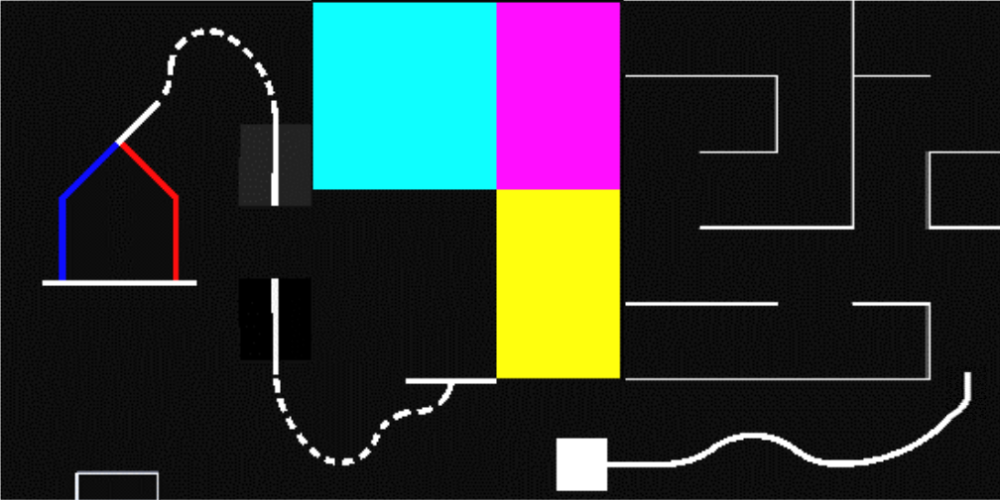
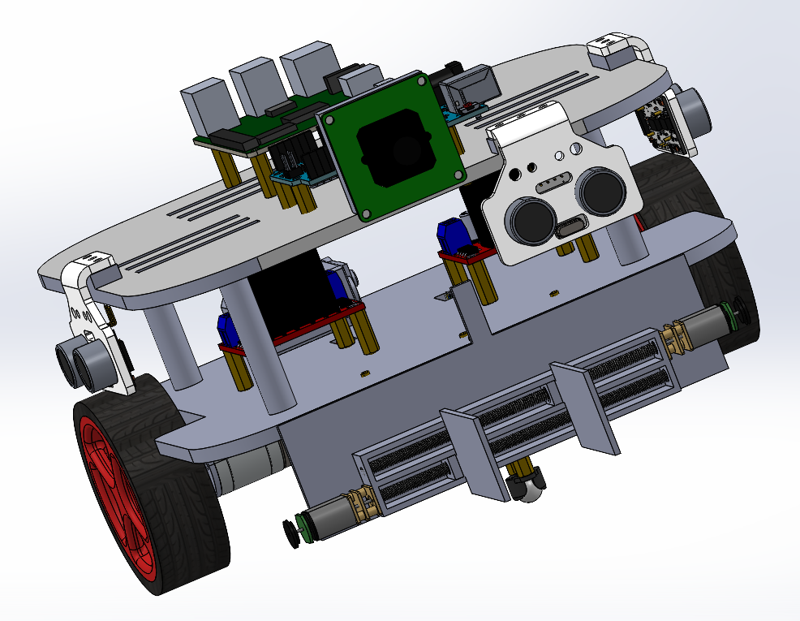

# XtemeV Robot
This robot was designed for the task given in **EN2532 - Robot Design and Competition** module in Semester 3 (2021), University of Moratuwa.

## Task
1. Line following
    - The robot must follow a white line on a black surface. These paths may contain straight
lines, curved lines, or dotted line segments.
2. Wall maze
    - After a line following section, the robot will have to navigate through a wall maze
section. This maze will not contain any looping paths. (A single possible path from
start to end is guaranteed.)
3. Mosaic Floor Area
    - The robot exiting the wall maze should immediately enter the mosaic floor area and
proceed to complete the following subtasks. Inserting the key solids to respective
keyholes to close the bridge. Collecting the ball of the color assigned to your team at
the start of the competition.
4. Bridge
    - The robot should cross the closed bridge and exit the area to a dotted line segment.
5. Shooting area
    - The robot must choose the correct path at the Y junction area according to the assigned color. While staying in the restricted space, the robot will have to shoot the
collected ball into the goal.
 

    

 

## Robot Design
 

    

 

### Components that are being used in our robot are as follows,
- Pololu motors 
- N20 motors
- IR panel (QTR - 8RC)
- Ultrasonic Sensor (HC-SR04)
- Raspberry Pi Camera
- Raspberry Pi 3B+
- Arduino Mega
- Motor Controller (L298N)
## Team Members
- [K. D. Supun Dasantha Kuruppu](https://github.com/SupunDK)
- [W. M. Limalka Sadith](https://github.com/limalkasadith)
- [Sithuruwan Prathapasinghe](https://github.com/PrathapasingheSP99)
- [E. M. Dumindu Ashen Bandara](https://github.com/Dumindu-Bandara)
- [Biyon Fernando](https://github.com/BiyonFernando)
